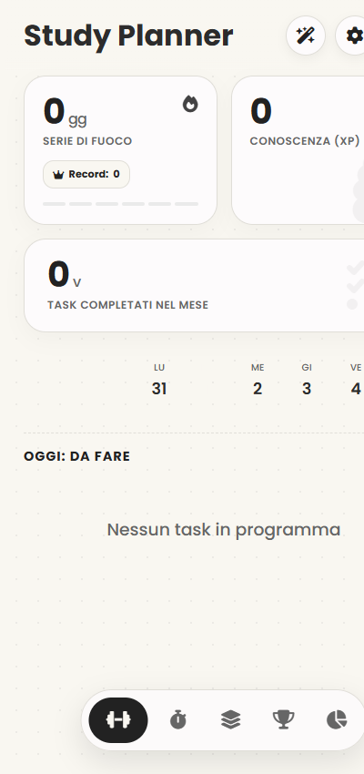
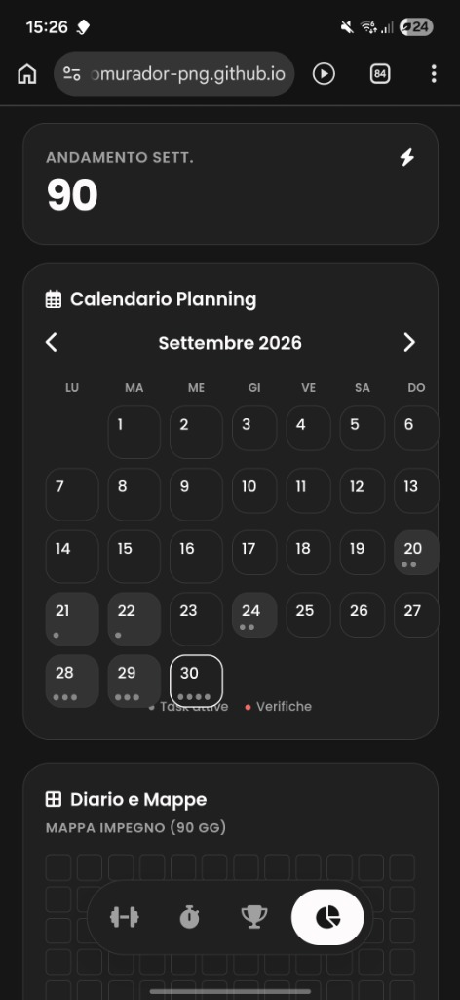
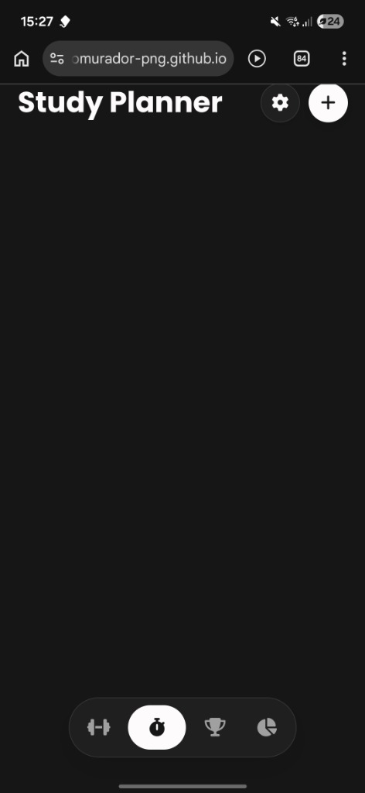

<div align="center">


# Study Planner

Il taccuino digitale per la gestione intelligente dello studio, delle verifiche, del focus profondo e della memorizzazione a lungo termine.

[](https://tommasomurador-png.github.io/StudyPlanner/)
[](https://github.com/tommasomurador-png/StudyPlanner/releases/latest)
[](https://github.com/tommasomurador-png/StudyPlanner/actions/workflows/build-apk.yml)
[](LICENSE)

<p align="center">
  <a href="https://tommasomurador-png.github.io/StudyPlanner/"><b>Apri la Web App Online</b></a>
</p>

</div>

---

## Screenshots

Fai clic su un'immagine per aprirla a piena risoluzione.

<p align="center">
  
  
  
</p>

---

## Perche Study Planner fa la differenza

A differenza delle tradizionali applicazioni per to-do list, Study Planner e' progettato appositamente per le reali necessita' di studenti e studentesse. Integra pianificazione automatica dei carichi, ripetizione spaziata e strumenti di concentrazione all'interno di un'unica interfaccia pulita, priva di pubblicita' e orientata alla massima privacy locale.

- **Privacy totale e funzionamento offline:** Tutti i dati, i voti, le verifiche e le note rimangono memorizzati unicamente sul dispositivo dell'utente. Non richiede registrazione di account, login remoti ne' tracciamento pubblicitario.
- **Ripartizione dinamica del carico di lavoro:** Calcola il ritmo ottimale di pagine ed esercizi giorno per giorno fino alla data della prova. Se un giorno studi meno del previsto, l'algoritmo distribuisce automaticamente il carico residuo sulle giornate rimanenti.
- **Focus Pomodoro essenziale:** Timer minimalista per studio profondo con modalita' Lavoro e Pausa affiancate, privo di notifiche invadenti e con tracciamento delle sessioni concluse.
- **Flashcard con Ripetizione Spaziata:** Sistema basato sul metodo Leitner a tre livelli (1 giorno, 3 giorni, 7 giorni) con carta 3D interattiva per consolidare formule e definizioni nella memoria a lungo termine.
- **Generatore di Quiz con AI e Tutor:** Incolla gli appunti o le sintesi di testo per ricavare 5 domande a risposta multipla con spiegazione immediata e salvataggio diretto degli errori nelle flashcard.
- **Widget nativo per Android:** Widget integrabile sulla schermata home dello smartphone per consultare lo stato della serie di giorni e le task odierne a colpo d'occhio.

### Piattaforme supportate

- **Android:** Applicazione nativa con Widget per la schermata Home, integrazione del tasto Indietro hardware, vibrazione aptica e canali di notifica locali.
- **Web e Progressive Web App (PWA):** Accessibile da qualsiasi browser moderno su computer, tablet e smartphone, installabile sulla schermata iniziale e fruibile senza connessione a Internet.

---

## Come installare

### 1. Applicazione Android nativa (APK)

1. Apri la sezione **[Releases](https://github.com/tommasomurador-png/StudyPlanner/releases/latest)** del repository GitHub.
2. Scarica il pacchetto `StudyPlanner.apk` compilato tramite il sistema di Continuous Integration.
3. Apri il file scaricato sul dispositivo Android e conferma l'installazione.
4. Tieni premuto uno spazio vuoto della schermata iniziale per aggiungere il widget Study Planner.

### 2. Installazione Web App (PWA)

1. Visita la pagina ufficiale: **[tommasomurador-png.github.io/StudyPlanner](https://tommasomurador-png.github.io/StudyPlanner/)**.
2. Apri il menu del browser (o il pulsante Condividi su iOS / Safari).
3. Seleziona **"Aggiungi a schermata Home"** o **"Installa applicazione"**.

---

## Funzionalita Principali nel Dettaglio

### 1. Pianificazione dello Studio e Gestione Verifiche
- Calcolo automatico della quantita' di studio giornaliera fino al giorno della verifica o dell'interrogazione.
- Riorganizzazione immediata del carico residuo in caso di compiti incompleti o imprevisti.
- Esclusione mirata di date di pausa per festivi, vacanze o impegni personali compresi tra oggi e la scadenza.
- Sistema Snooze con opzione di riprogrammazione manuale o automatica dei compiti.

### 2. Pomodoro Focus Timer
- Selettore combinato di modalita' Lavoro e Pausa con durate rapide preimpostate (15, 25, 45, 60 minuti).
- Anello di avanzamento circolare ad alta visibilita' privo di testo o elementi di distrazione.
- Conteggio cumulativo dei minuti a fuoco e delle sessioni portate a termine con successo.
- Meccanismo di gamification basato su punti Conoscenza (XP), Serie di Fuoco e Gradi Accademici da Matricola fino a Einstein.

### 3. Flashcard con Ripetizione Spaziata (Metodo Leitner)
- Carta tridimensionale con animazione fluida di rotazione per visualizzare domanda e risposta.
- Classificazione della difficolta' con intervalli scientifici: Difficile (1 giorno), Buono (3 giorni), Facile (7 giorni).
- Filtri per singola materia di studio per eseguire sessioni mirate su specifici argomenti.
- Cassetto espandibile per consultare l'intero mazzo, monitorare i livelli delle carte ed eliminare quelle obsolete.
- Funzione di ripristino per ripassare tutte le carte del mazzo a piacere.

### 4. Generatore di Quiz con AI e Tutor
- Trasformazione istantanea di appunti o capitoli incollati in 5 domande a risposta multipla con 4 alternative ciascuna.
- Supporto per chiave API personale Google Gemini (Google AI Studio) per elaborazioni avanzate.
- Motore euristico locale funzionante al 100% offline in modalita' aereo o in assenza di rete.
- Spiegazione dettagliata della risposta corretta presentata subito dopo la selezione.
- Conversione automatica delle domande con risposta errata in nuove flashcard del mazzo con un solo tocco.

### 5. Statistiche, Calendario e Grafico per Materia
- Calendario mensile con indicatori distinti per verifiche in programma e compiti da completare.
- Grafico Donut vettoriale per osservare la percentuale e il numero di task suddivisi per materia.
- Mappa di impegno continuativo a 90 giorni ispirata ai contributi di GitHub.
- Grafico a barre dell'andamento settimanale con conteggio complessivo degli XP maturati.

### 6. Widget Nativo per Schermata Home Android
- Componente AppWidget nativo sviluppato tramite AppWidgetProvider di Android.
- Monitoraggio in tempo reale del numero di giorni consecutivi di studio (Serie di Fuoco).
- Promemoria sintetico delle task ancora da svolgere nel corso della giornata.
- Accesso immediato con pulsante dedicato per aprire direttamente il timer Pomodoro.

---

## Architettura del Progetto

```text
StudyPlanner/
|-- .github/workflows/
|   `-- build-apk.yml               Compilazione automatica APK e pubblicazione release
|-- app/
|   |-- src/main/
|   |   |-- assets/                 File sorgente web inclusi nell'applicazione nativa
|   |   |-- java/.../
|   |   |   |-- MainActivity.kt     Gestione WebView, navigazione e interfaccia JavaScript
|   |   |   `-- StudyPlannerWidgetProvider.kt   Logica del Widget per la schermata home
|   |   |-- res/
|   |   |   |-- layout/             Layout XML del widget nativo Android
|   |   |   |-- xml/                Metadati di configurazione del widget
|   |   |   `-- values/             Definizione colori, stringhe e stili nativi
|   |   `-- AndroidManifest.xml     Permessi, configurazione receiver e activity
|   `-- build.gradle.kts            Configurazione di compilazione del modulo Android
|-- css/
|   `-- style.css                   Stili modulari, temi Chiaro/Scuro e fogli grafici
|-- js/
|   `-- app.js                      Algoritmo di carico, Leitner, quiz AI, timer e storage
|-- screenshots/
|   |-- dashboard_view.png          Cattura della schermata dashboard
|   |-- calendar_view.jpg           Cattura della schermata calendario e statistiche
|   `-- interface_view.jpg          Cattura dell'interfaccia principale
|-- gradle/wrapper/                 Gradle Wrapper v8.13 per compilazione uniforme
|-- build.gradle.kts                Configurazione root di Gradle
|-- settings.gradle.kts             Definizione moduli di progetto
|-- index.html                      Interfaccia grafica principale dell'applicazione
|-- manifest.json                   Manifest PWA con scorciatoie rapide
|-- sw.js                           Service Worker per la cache offline
|-- 1790418729575_cutout.png        Icona ufficiale dell'applicazione
`-- LICENSE                         Licenza open source MIT
```

---

## Come Contribuire

I contributi da parte della community sono benvenuti per migliorare Study Planner:

1. Esegui il Fork del repository.
2. Crea un branch dedicato alla tua funzionalita':
   `git checkout -b feature/nome-funzionalita`
3. Effettua il commit delle modifiche:
   `git commit -m "feat: descrizione delle modifiche apportate"`
4. Esegui il push del branch sul tuo fork:
   `git push origin feature/nome-funzionalita`
5. Apri una Pull Request descrivendo gli interventi effettuati.

---

## Licenza

Questo progetto e' rilasciato sotto i termini della Licenza **MIT**. Consulta il file [LICENSE](LICENSE) per tutti i dettagli legali.

---

## Contatti e Supporto

- Repository GitHub: [tommasomurador-png/StudyPlanner](https://github.com/tommasomurador-png/StudyPlanner)
- Segnalazione bug e suggerimenti: [GitHub Issues](https://github.com/tommasomurador-png/StudyPlanner/issues)
- Autore: [@tommasomurador-png](https://github.com/tommasomurador-png)
